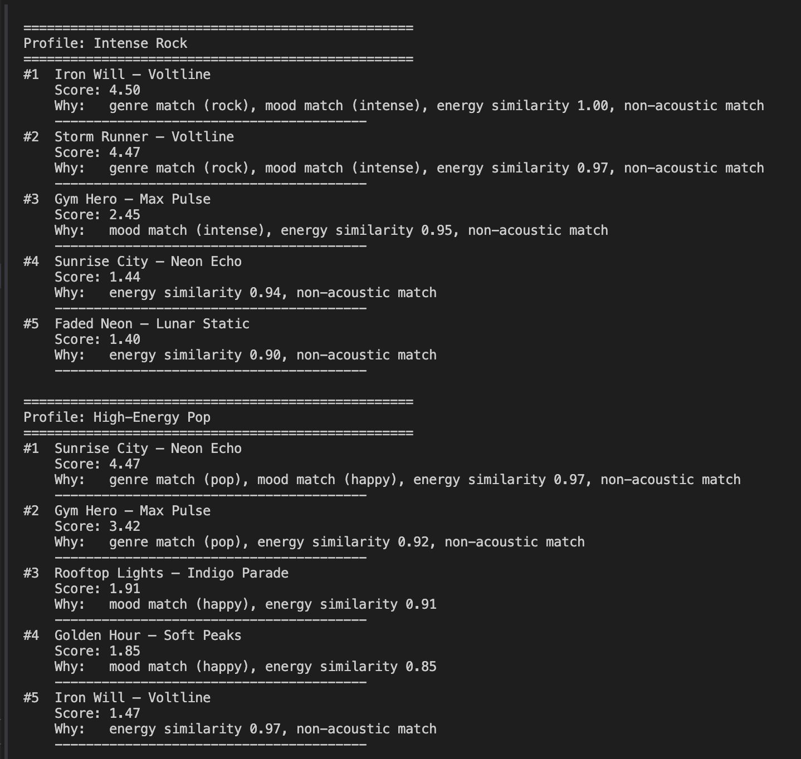
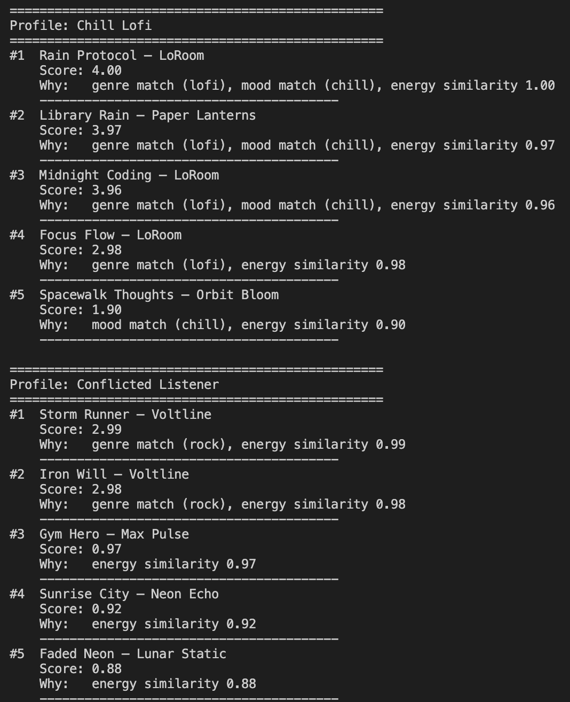

# 🎵 Music Recommender Simulation

## Project Summary

VibeFinder 1.0 is a content-based music recommender that scores songs 
against a user's taste profile using genre, mood, energy, and acoustic 
preference. It returns the top 5 matches with an explanation for each 
recommendation. Built as a CodePath AI110 course project to explore how 
real-world recommenders work under the hood.

---

## How The System Works

Real-world recommenders like Spotify learn from massive behavior data — 
skips, replays, playlists — to predict what you'll want next. This 
simulation takes a simpler, transparent approach: it matches songs 
directly against an explicit user taste profile using a weighted scoring 
formula. Every recommendation can be explained by pointing to the exact 
features that drove the score.

### Song Features

Each `Song` object stores the following attributes from `data/songs.csv`:

- `genre` — categorical style label (e.g. pop, lofi, rock, jazz, synthwave)
- `mood` — emotional quality (e.g. happy, chill, intense, relaxed, focused, moody)
- `energy` — float from 0 to 1, how energetic the track feels
- `tempo_bpm` — beats per minute
- `valence` — float from 0 to 1, musical positiveness
- `danceability` — float from 0 to 1, how suitable the track is for dancing
- `acousticness` — float from 0 to 1, how acoustic vs. electronic the track sounds

### UserProfile Features

- `favorite_genre` — the genre the user most wants to hear
- `favorite_mood` — the mood the user is currently seeking
- `target_energy` — preferred energy level, float from 0 to 1
- `likes_acoustic` — boolean for whether they prefer acoustic over electronic

### Algorithm Recipe

Each song is scored by four rules summed into a total, then ranked:

- **Genre match** — `+2.0` if genre matches, else `0`
- **Mood match** — `+1.0` if mood matches, else `0`
- **Energy proximity** — `1.0 × (1.0 − |song.energy − target_energy|)`
- **Acoustic bonus** — `+0.5` if acoustic preference matches, else `0`

The top `k` songs by total score are returned as recommendations.

### Potential Biases

- Genre carries the highest weight so songs that miss on genre rarely surface even with strong mood and energy matches
- Genre and mood are correlated in this catalog (every rock song is "intense") so those two rules can double-count the same signal
- No diversity control — the same artist can fill multiple top slots

---

## Getting Started

### Setup

1. Create a virtual environment (optional but recommended):

```bash
python -m venv .venv
source .venv/bin/activate      # Mac or Linux
.venv\Scripts\activate         # Windows
```

2. Install dependencies:

```bash
pip install -r requirements.txt
```

3. Run the app:

```bash
python -m src.main
```

### Running Tests

```bash
pytest
```

---

## Terminal Output




---

## Experiments You Tried

- **Weight shift:** Halved genre weight (2.0 → 1.0) and doubled energy 
  weight. Rankings shifted noticeably — songs with strong energy matches 
  but different genres moved up, showing how sensitive the system is to 
  small design choices.
- **Edge case profile:** Tested a Conflicted Listener (rock/sad/high energy) 
  — no sad rock songs exist in the dataset so mood scored 0 for every song 
  and the ranking fell back to genre and energy only.

---

## Limitations and Risks

- Only works on a tiny 15-song catalog
- Cannot learn from feedback — same inputs always produce same outputs
- Over-favors genres that appear more in the dataset (pop and lofi)
- Fails silently for users whose preferred genre or mood isn't represented

---

## Reflection

Read and complete `model_card.md`:

[**Model Card**](model_card.md)

## Profile Comparisons

**Intense Rock vs High-Energy Pop:**
Both profiles want high energy but genre keeps them completely separate.
Rock always surfaces Iron Will and Storm Runner while pop surfaces 
Sunrise City and Gym Hero. Even though Gym Hero has nearly identical 
energy to Storm Runner, it never tops the rock profile because the 
genre weight (2.0 points) alone outweighs everything else.

**High-Energy Pop vs Chill Lofi:**
These are opposite profiles and the results show it clearly. The lofi 
profile shifts entirely toward quiet songs like Rain Protocol and Library 
Rain. No song appears in both top 5 lists, showing the system cleanly 
separates very different tastes when the dataset has enough variety.

**Conflicted Listener (rock/sad/high energy/acoustic):**
This was the most revealing result. No sad rock songs exist in the 
dataset so mood scored 0 for every song. The ranking fell back to 
genre and energy only, proving the system cannot handle conflicting 
preferences — it silently ignores signals with no dataset matches.

## Biggest Learning Moment
A simple scoring function can feel intelligent for profiles that match 
the dataset well but completely breaks down for edge cases. The algorithm 
is not understanding music — it is just doing math.

## How AI Tools Helped
Copilot helped me write CSV loading and sorting logic quickly. But I had 
to verify the math myself — catching that genre comparisons needed 
lowercase matching and that energy similarity never goes negative.

## What Surprised Me
The Chill Lofi profile produced the most accurate-feeling results even 
though it had the lowest possible scores (max 4.0 vs 4.5 for others). 
High scores don't always mean better recommendations — it depends on 
how well the dataset matches the user.

## What I Would Try Next
Add a feedback loop where users rate results and weights adjust 
automatically. Also expand to at least 100 songs — 15 is too small 
to handle niche or conflicting taste profiles.